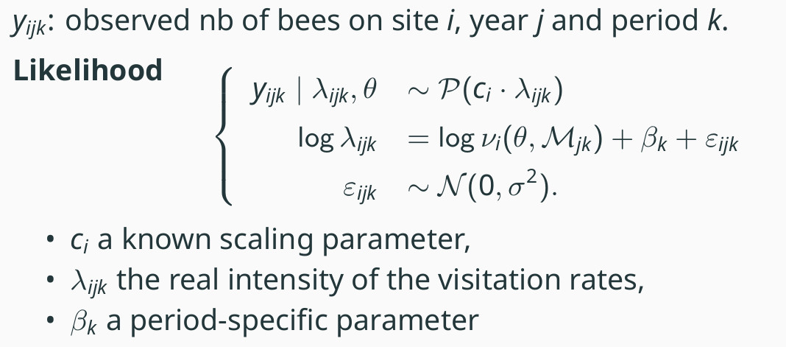

# BLOOM: Bayesian caLibration Of pOllination Model

blOOm is a set of R functions for the simulation and calibration of a
pollination model based on central-place foraging (CPF) theory.

## Introduction

 Here
we present the code to run and calibrate the CPF model using Approximate Baeysian Computation.
The statistical model assumes that bee abundances are Poisson-distributed, with the logarithm 
of the Poisson intensity being a linear function of the logarithm of the CPF predictions.

 In the
right-hand side equations,
")
represents the output from the CPF model,
 is
the set of parameters from the CPF model and

is the rasterized map for year
 and period
.

`blOOm` proposes a Bayesian approach to perform parameter estimation,
using approximate bayesian computation (ABC) since the likelihood is
intractable.

## Contents

The repository has the following structure:

``` bash
.
├── analyses
│   └── results
├── data
├── man
├── R
```

### Analyses

In the `data` folder, several data are provided: example files needed as 
inputs for the CPF model, as well as prior distributions for the parameters.
Summary statistics are provided both on simulated and real data. An object
generated from the `blOOm` framework, of class `simulationObj` and containing
all the required information about the data is also available. Note that
only **true summary statistics** are provided, but that **true raw data** are
not provided.

In the `analysis` folder, you can find R scripts for data analysis and
calibration. This is also where the result of the analyses are saved (in
a subfolder named `results`).

File `createABCtable.R` allows to generate several samples from the model,
according to priors which must be specified. This part of the analysis 
is time-consuming. Therefore, example files are provided in the `results`
folder to illustrate the analyses.

Once the ABC table is computed, summary statistics can be computed.
The corresponding scripts are `computeSumStats.R` for ABC tables, and
`computeSumStatsObsData.R` for observed data.

Once the summary statistics are computed for both the observed data and
the ABC table, the analyses can be performed.

-   `runABC_simuData.R` runs different ABC approaches on simulated data,
    using a subset of the simulations as references.
-   `runABC_realData.R` runs different ABC approaches on real data.
-   `analyzeResults.R` and `analyzeResults_realData.R` are used to produce
    graphs and compute relative absolute errors
-   `posteriorPredictiveCheck.R` generate samples from the posterior predictive
distribution
